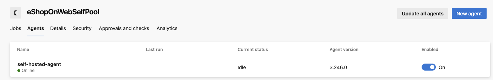

# terraform-selfhostedagentpool

Helps you build an Azure lab environment for running Azure DevOps self-hosted agents on Windows.

## Disclaimer

This is a personal project. The code is provided as-is without any warranty. Use at your own risk.
The project is intended for lab environments only. Do not use in production.

## Prerequisites

- Azure subscription
- Azure DevOps account
- Azure DevOps organization
- Azure DevOps project
- Azure DevOps PAT (Personal Access Token)
- Azure DevOps agent pool

## RBAC

### Terraform Service Principal

The Terraform script requires a service principal with the following permissions:

- Contributor on the subscription

Azure CLI command to create a service principal:

```bash
az ad sp create-for-rbac --name tfporvider --role="Contributor" --scopes="/subscriptions/<subscription_id>" --sdk-auth
```

This script will output a JSON object with the service principal credentials. Save this JSON object safely.

```json
{
  "clientId": "",
  "clientSecret": "",
  "subscriptionId": "",
  "tenantId": "",
  "activeDirectoryEndpointUrl": "https://login.microsoftonline.com",
  "resourceManagerEndpointUrl": "https://management.azure.com/",
  "activeDirectoryGraphResourceId": "https://graph.windows.net/",
  "sqlManagementEndpointUrl": "https://management.core.windows.net:8443/",
  "galleryEndpointUrl": "https://gallery.azure.com/",
  "managementEndpointUrl": "https://management.core.windows.net/"
}
```

Some of the values, you need for your own **terraform.tfvars** later on.

## Usage

1. Clone the repository, or import the files into your own repository.

```bash
git clone https://github.com/Jihillestad/terraform-selfhostedagentpool.git
```

2. Make your own **terraform.tfvars** file. Look at **variables.tf** for the
   variables you need to set. You need values from the **service principal**
   JSON object from the previous step. You also need to set the **url** to your
   Azure DevOps organization and the **pat** to your Personal Access Token.

```hcl
subscription_id = ""
client_id       = ""
client_secret   = ""
tenant_id       = ""
rg_name         = "rg-eshoponweb-agentpool"
vm_name         = "eshoponweb-vm"
admin_username  = "sysadmin"
url             = "https://dev.azure.com/{your_organization}/"
pat             = ""
pool            = "eShopOnWebSelfPool"
```

3. If you want to use local state, you can remove the **backend block** from the
   **main.tf** file. If you want to use remote state, you can use the Azure
   Storage Account backend. You need to set the **storage_account_name** and
   **container_name** in the **backend block**. I recommend using **Azure CLI**
   to create the **Storage Account** and **Container**, as wel as the storage
   access key in a **keyvault**. Then add the key to the environment variable
   AZURE_STORAGE_KEY which Terraform will use to authenticate.

```hcl
terraform {
  backend "azurerm" {
    resource_group_name  = "rg-eshoponweb-agentpool"
    storage_account_name = ""
    container_name       = ""
    key                  = "terraform-shagent.tfstate"
  }
}
```

4. Initialize the Terraform environment.

```bash
terraform init
```

5. Plan the Terraform deployment.

```bash
terraform plan -out=main.tfplan
```

6. Apply the Terraform deployment.

```bash
terraform apply main.tfplan
```

7. Verify the deployment in the Azure portal.

8. Verify the deployment in the Azure DevOps organization. You should see the new agent pool.
   

9. To keep costs down, remember to destroy the resources when you are done.

```bash
terraform destroy
```
